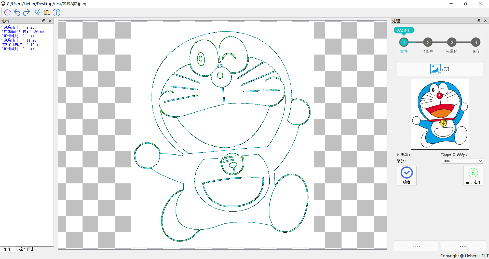
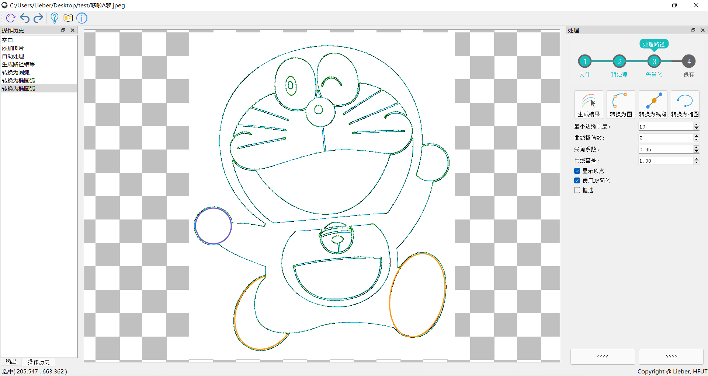
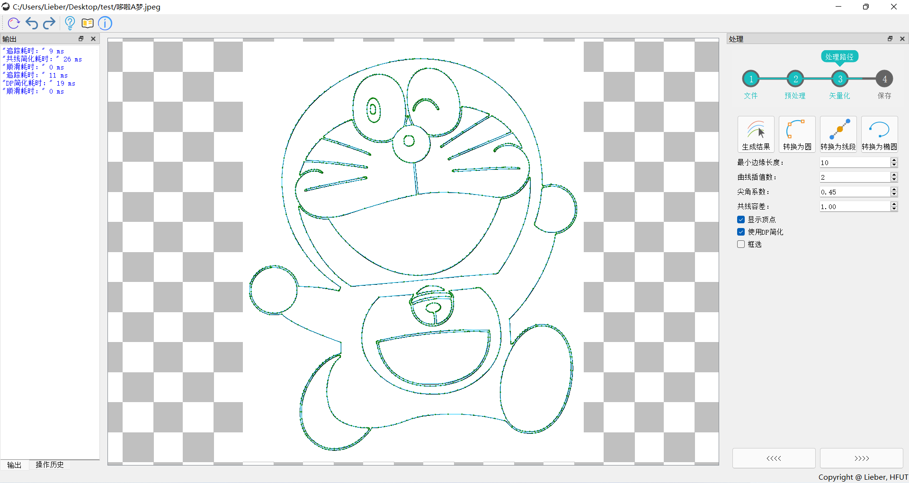

# ImageAlgo
基于Qt的图像轮廓矢量化工具，主要包括以下步骤：

（1）预处理：OSTU最佳阈值、中值/高斯滤波、锐化、边缘检测（Sobel和Canny算子）;

（2）边缘追踪：径向扫描法（http://www.imageprocessingplace.com/downloads_V3/root_downloads/tutorials/contour_tracing_Abeer_George_Ghuneim/ray.html）；

（3）边缘简化：根据DDA/Bresenham画线原理，逆向判断像素点共线。亦提供Douglas-Peucker方法简化；

（4）边缘顺滑：相邻折线段采用二阶Bezier曲线替代轮廓。

导航进度条来自于http://www.qtcn.org/bbs/read-htm-tid-62954.html

提供撤回/重做功能

结果可以交互，转换后的特征用不同颜色区分。可保存为svg/dxf文件
